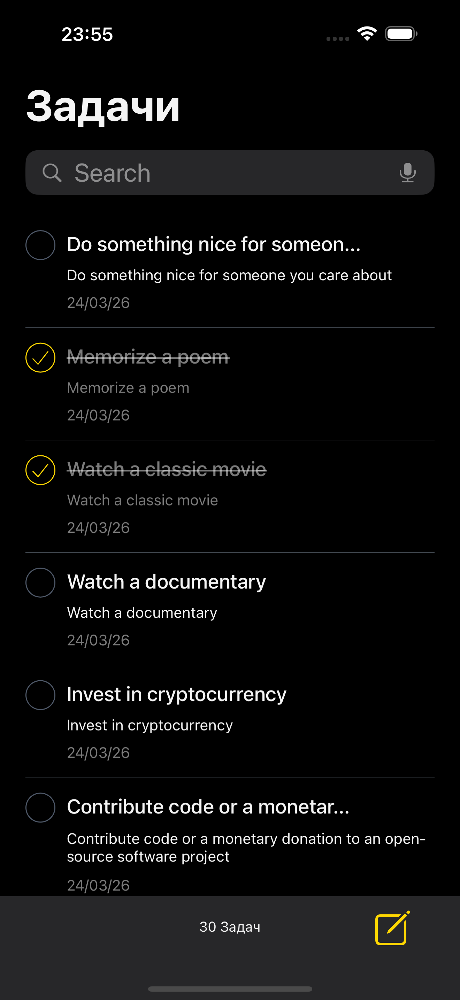
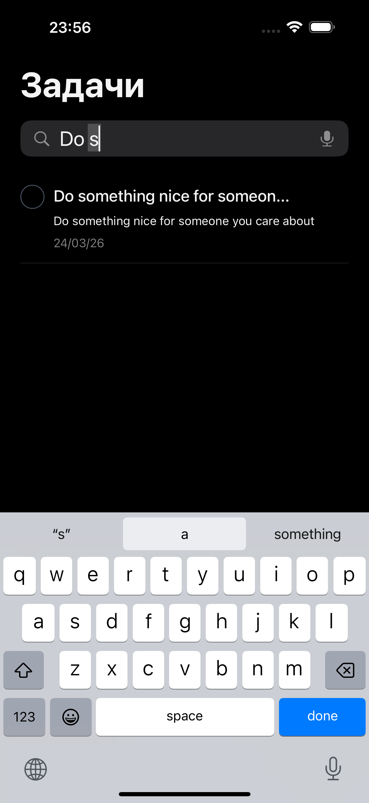
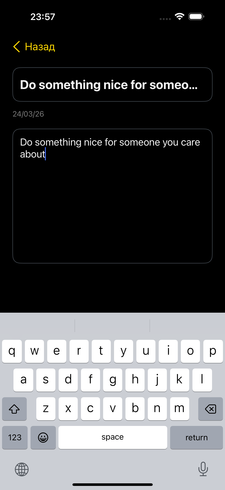
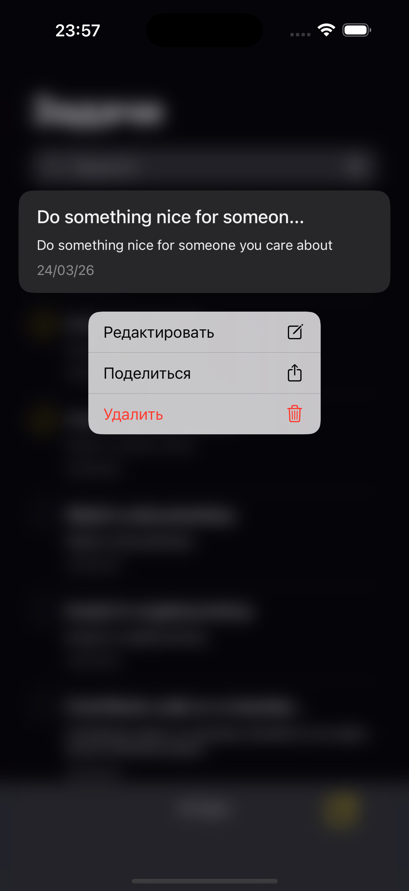
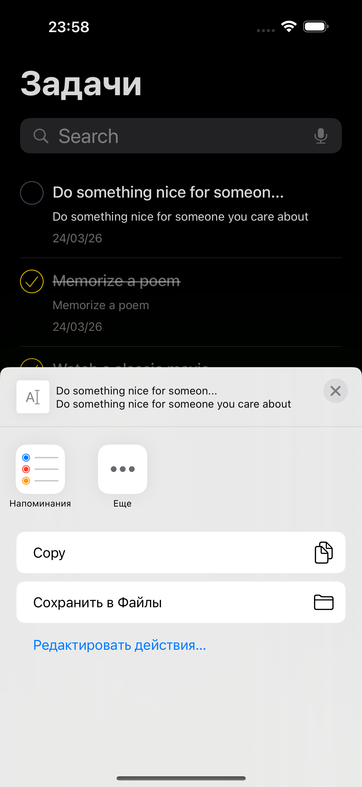
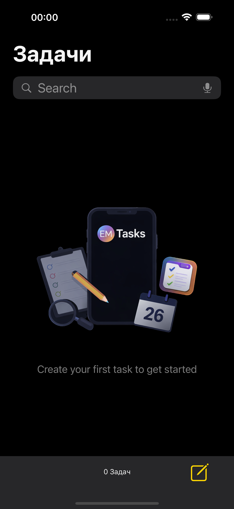

# EMTasks

Test task iOS application written in Swift.

## 📱 Description

EMTasks is a simple and clean To-Do List application.

The app allows users to:
- Create tasks
- Edit tasks
- Delete tasks
- Mark tasks as completed
- Search tasks

Tasks are loaded from a remote API and stored locally using CoreData.

---

## 🧠 Architecture

The project is built using the **MVP (Model–View–Presenter)** pattern.

- **View** — handles UI and user interaction  
- **Presenter** — processes business logic  
- **Model** — represents data  

---

## ⚙️ Features

- Task list with title, description and date  
- Create / edit / delete tasks  
- Mark tasks as completed  
- Search functionality  
- Context menu (edit / share / delete)  
- Empty state (custom UI when no tasks)  
- Network loading from API  
- Local persistence with CoreData  
- Background thread operations (GCD)  

---

## 🛠 Technologies

- Swift  
- UIKit  
- MVP architecture  
- CoreData  
- URLSession  
- GCD  
- XCTest  

---

## 🚀 How to run

1. Open `EMTasks.xcodeproj`
2. Run on simulator or real device

---

## 📸 Screenshots

  
  
  

 

  
  
  

---

## 👤 Author

Evgenii Lukin
